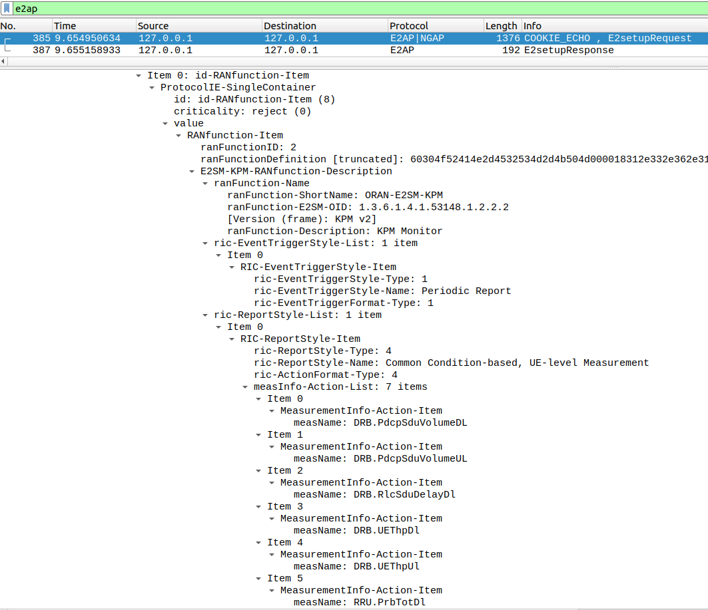

# OpenAirInterface License #

 *  [OAI License Model](http://www.openairinterface.org/?page_id=101)
 *  [OAI License v1.1 on our website](http://www.openairinterface.org/?page_id=698)

It is distributed under **OAI Public License V1.1**.

The license information is distributed under [LICENSE](LICENSE) file in the same directory.

Please see [NOTICE](NOTICE.md) file for third party software that is included in the sources.

# Overview

This tutorial describes the steps of deployment 5G OAI RAN, with integrated E2 agent and a nearRT-RIC using O-RAN compliant FlexRIC.

[[_TOC_]]

# 1. Installation

## 1.1 Install prerequisites

### 1.1.1 GCC compiler

FlexRIC triggers a compiler bug in gcc-11 and is therefore not supported.
Please make sure you have gcc-12 installed (gcc-10 and 13 should also work but
we recommend gcc-12). Follow the next steps:
```bash
sudo apt update -y
sudo apt upgrade -y
sudo apt install -y build-essential
sudo apt install -y gcc-12 g++-12 cpp-12
sudo update-alternatives --install /usr/bin/gcc gcc /usr/bin/gcc-12 100 --slave /usr/bin/g++ g++ /usr/bin/g++-12 --slave /usr/bin/gcov gcov /usr/bin/gcov-12
sudo update-alternatives --config gcc # chose gcc-12
```

### 1.1.2 CMake (at least v3.15).

On Ubuntu, you should use [this PPA](https://apt.kitware.com/) to install an up-to-date version.

### 1.1.3 Flatbuffer encoding (optional, advanced)

FlexRIC has experimental support for an alternative encoding/decoding scheme
using Flatbuffers. Refer to the [FlexRIC
README](https://gitlab.eurecom.fr/mosaic5g/flexric) in case you are interested
to try it.

## 1.2 Download the required dependencies

### 1.2.1 Mandatory dependencies
```bash
sudo apt install libsctp-dev cmake-curses-gui libpcre2-dev
```

### 1.2.2 Multi-language xApp requirements (optional)

- SWIG (at least  v.4.1).

  We use SWIG as an interface generator to enable the multi-language feature
  (i.e., C/C++ and Python) for the xApps. Please, check your SWIG version (i.e,
  `swig -version`) and install it from scratch if necessary as described here:
  https://swig.org/svn.html or via the code below:

  ```bash
  git clone https://github.com/swig/swig.git
  cd swig
  git checkout release-4.1
  ./autogen.sh
  ./configure --prefix=/usr/
  make -j8
  make install
  ```

- Python dependencies
  ```bash
  sudo apt install python3.8 python-dev
  ```

# 2. Deployment

## 2.1 OAI RAN

### 2.1.1 Clone the OAI repository

We use the same version of OAI as the [RAN tutorial](../ran/README.md), i.e.,
tag `2024.w26`.

```bash
git clone https://gitlab.eurecom.fr/oai/openairinterface5g oai
cd oai/
git checkout 2024.w26
```

Note: you can of course do that in an existing repository.

### 2.1.2 Build OAI with E2 Agent

Currently available versions:
|            |KPM v2.03|KPM v3.00|
|:-----------|:--------|:--------|
| E2AP v1.01 | Y       | Y       |
| E2AP v2.03 | Y       | Y       |
| E2AP v3.01 | Y       | Y       |

Please note that KPM SM v2.01 is supported only in FlexRIC, but not in OAI.
By default, OAI will build the E2 Agent with E2AP v2 and KPM v2. If you want a
different version, by passing `--cmake-opt -DE2AP_VERSION=E2AP_VX` with
`X`=`1`,`2`,`3`, and `--cmake-opt -DKPM_VERSION=KPM_VX` with `X`=`2_03`,`3_00`

```bash
cd cmake_targets/
./build_oai -I # only first time install for OAI
./build_oai -c --gNB --nrUE --build-e2 --ninja
```

* `-I` option is to install pre-requisites, you only need it the first time you build the softmodem or when some oai dependencies have changed.
* `--gNB` is to build the `nr-softmodem` and `nr-cuup` executables and all required shared libraries
* `--nrUE` is to build the `nr-uesoftmodem` executable and all required shared libraries
* `--ninja` is to use the ninja build tool, which speeds up compilation
* `--build-e2` option is to use the E2 agent, integrated within RAN.

If the `openair2/E2AP/flexric` folder is empty, try manually the following commands:
```bash
git submodule init
git submodule update
```

## 2.2 FlexRIC

By default, FlexRIC will build the nearRT-RIC with E2AP v2 and KPM v2. If you
want a different version, edit the cmake variable `E2AP_VERSION` and
`KPM_VERSION` during cmake invocation as shown below. Note that OAI's and
FlexRIC's `E2AP_VERSION` and `KPM_VERSION` need to match to avoid
incompatibilities among versions.

### 2.2.1 Clone the FlexRIC repository

```bash
git clone https://gitlab.eurecom.fr/mosaic5g/flexric flexric
cd flexric/
git checkout beabdd072ca9e381d4d27c9fbc6bb19382817489
```

Note! Instead of manually cloning this in a separate directory, you can of
course simply use the git submodule directory in the RAN, skip the clone, and
proceed with the next section.

### 2.2.2 Build FlexRIC

If you have installed optional libraries from section [1.2.2 Multi-language xApp requirements (optional)](#122-multi-language-xapp-requirements-optional), run this command:
```bash
mkdir build && cd build && cmake .. && make -j8
```

You can pass a number of variables to cmake:
- `-DXAPP_MULTILANGUAGE=OFF` to disable the usage of SWIG (meaning, that only
xApps written in C will be supported.
- `-DE2AP_VERSION=E2AP_VX` with `X`=`1`,`2`,`3` to select the E2AP version.
- `-DKPM_VERSION=KPM_VX` with `X`=`2_01`,`2_03`,`3_00` to select the KPM
version.

### 2.2.3 Installation of Service Models (SMs)

You need to install the SMs to use them in FlexRIC (important!):
```bash
sudo make install
```

By default the service model libraries will be installed in the path
`/usr/local/lib/flexric` while the configuration file is in
`/usr/local/etc/flexric`.

# 3. Service Models available in OAI RAN

## 3.1 O-RAN

For a deeper understanding, we recommend that users of FlexRIC familiarize
themselves with O-RAN WG3 specifications available at the [O-RAN specifications
page](https://orandownloadsweb.azurewebsites.net/specifications).

The following specifications are recommended:
- O-RAN.WG3.E2GAP-v02.00 - nearRT-RIC architecture & E2 General Aspects and Principles
- O-RAN.WG3.E2AP-v02.03 - E2AP protocol description
- O-RAN.WG3.E2SM-KPM-v02.03 - KPM Service Model description
- O-RAN.WG3.E2SM-RC-v01.03 - RAN Control Service Model description

### 3.1.1 E2SM-KPM

As mentioned in section [2.1.2 Build OAI with E2
Agent](#212-build-oai-with-e2-agent), we support KPM v2.03/v3.00. Both use
ASN.1 encoding.

Per O-RAN specifications, 5G measurements supported by KPM are specified in
3GPP TS 28.552.

From 3GPP TS 28.552, at the moment, we support the following list:
* `DRB.PdcpSduVolumeDL`
* `DRB.PdcpSduVolumeUL`
* `DRB.RlcSduDelayDl`
* `DRB.UEThpDl`
* `DRB.UEThpUl`
* `RRU.PrbTotDl`
* `RRU.PrbTotUl`

From O-RAN.WG3.E2SM-KPM-version specification, we implemented:
* REPORT Service Style 4 ("Common condition-based, UE-level" - section 7.4.5) - fetch above measurements per each UE that matches common criteria (e.g. S-NSSAI).

### 3.1.2 E2SM-RC

We support RC v1.03. It uses ASN.1 encoding.

From ORAN.WG3.E2SM-RC-v01.03 specification, we implemented:
* REPORT Service Style 4 ("UE Information" - section 7.4.5) - aperiodic subscription for "UE RRC State Change"
* CONTROL Service Style 1 ("Radio Bearer Control" - section 7.6.2) - "QoS flow mapping configuration" (e.g creating a new DRB)

## 3.2 Custom Service Models

In addition, we support custom Service Models, such as MAC, RLC, PDCP, and GTP.
All use plain encoding, i.e., no ASN.1, but write the binary data into network
messages.  If you are interested in those, please follow the instructions in
the [FlexRIC README](https://gitlab.eurecom.fr/mosaic5g/flexric).

# 4. Start the process

## 4.1 Test with emulators

* Start the nearRT-RIC

  ```bash
  $ ./build/examples/ric/nearRT-RIC
  ```

* Start E2 Node agents

  * gNB-mono
    ```bash
    $ ./build/examples/emulator/agent/emu_agent_gnb
    ```
  * if CU/DU split is used, start the gNB as follows
    ```bash
    $ ./build/examples/emulator/agent/emu_agent_gnb_cu
    $ ./build/examples/emulator/agent/emu_agent_gnb_du
    ```

* Start different xApps

  * start the KPM monitor xApp - measurements stated in [3.1.1 E2SM-KPM](#311-e2sm-kpm) for each UE that matches S-NSSAI common criteria
    ```bash
    cd flexric
    ./build/examples/xApp/c/monitor/xapp_kpm_moni
    ```
    Note: we assume that each UE has only 1 DRB; CU-UP does not store the slices, therefore "coarse filtering" is used

  * start the RC monitor xApp - aperiodic subscription for "UE RRC State Change"
      ```bash
      cd flexric
      ./build/examples/xApp/c/monitor/xapp_rc_moni
      ```

  * start the RC control xApp - RAN control function "QoS flow mapping configuration" (e.g. creating a new DRB)
      ```bash
      cd flexric
      ./build/examples/xApp/c/kpm_rc/xapp_kpm_rc
      ```

  * start the (MAC + RLC + PDCP + GTP) monitor xApp
    ```bash
    cd flexric
    ./build/examples/xApp/c/monitor/xapp_gtp_mac_rlc_pdcp_moni
    ```
The latency that you observe in your monitor xApp is the latency from the E2
Agent to the nearRT-RIC and xApp.  This shows that FlexRIC can be used for use
cases with ultra low-latency requirements.

## 4.2 Test with OAI RAN

At this point, we assume the 5G Core Network is already running in the
background. Please follow [CN tutorial](../cn/README.md) for more information.

In order to configure E2 agent, please, add the following block in OAI's configuration file:
```bash
e2_agent = {
  near_ric_ip_addr = "127.0.0.1";
  sm_dir = "/usr/local/lib/flexric/"
}
```

* start E2 Node agents

  * start the gNB-mono
    ```bash
    cd oai/cmake_targets/ran_build/build
    sudo ./nr-softmodem -O <path-to/oai-workshops/oam/conf/gnb.sa.band78.fr1.106PRB.usrpb210.conf> --rfsim --sa -E
    ```

  * if CU/DU split is used, start the gNB as follows
    ```bash
    sudo ./nr-softmodem -O <path-to/oai-workshops/oam/conf/gnb-du.sa.band78.106prb.rfsim.conf> --rfsim --sa -E
    sudo ./nr-softmodem -O <path-to/oai-workshops/oam/conf/gnb-cu.sa.f1.conf> --sa
    ```

  * if CU-CP/CU-UP/DU split is used, start the gNB as follows
    ```bash
    sudo ./nr-softmodem -O <path-to/oai-workshops/oam/conf/du_for_cu_cp_up.conf> --rfsim --sa -E
    sudo ./nr-softmodem -O <path-to/oai-workshops/oam/conf/cucp.conf> --sa
    sudo ./nr-cuup -O <path-to/oai-workshops/oam/conf/cuup.conf> --sa
    ```

* start the nrUE
  ```bash
  cd oai/cmake_targets/ran_build/build
  sudo ./nr-uesoftmodem -r 106 --numerology 1 --band 78 -C 3619200000 --rfsim --sa -O <path-to/oai-workshops/oam/conf/ue.conf> -E
  ```

Run Wireshark and capture E2AP traffic by selecting `any` and set the capture
filter to `sctp`. Per O-RAN.WG3.E2GAP-v02.00 specifications, no SCTP port is
specified for E2AP protocol. In our implementation, we use port number 36421.
Please, add the following configuration in Wireshark:


* start the nearRT-RIC
  ```bash
  cd flexric
  ./build/examples/ric/nearRT-RIC
  ```

Check that you see the E2 Setup Request and Response messages in Wireshark.
Within E2 Setup Request message, E2 node sends his own capabilities, such are KPM and RC supported RAN Functions:




* Start iperf3 traffic
  * get UE IP address and open server port
    ```bash
    ifconfig  # get UE IP address on interface oaitun_ue1
    iperf3 -i1 -s --bind <UE-IP-address>
    ```

  * start DL traffic from traffic container `oai-ext-dn` within CN
    ```bash
    docker exec -t oai-ext-dn iperf3 -c <UE-IP-address> -t60 -B 192.168.70.135 -i1
    ```
    Note: for the UL traffic, add option `-R`

* Start different xApps

  * start the KPM monitor xApp - measurements stated in [3.1.1 E2SM-KPM](#311-e2sm-kpm) for each UE that matches S-NSSAI common criteria
    ```bash
    cd flexric
    ./build/examples/xApp/c/monitor/xapp_kpm_moni
    ```
    Note: we assume that each UE has only 1 DRB; CU-UP does not store the slices, therefore "coarse filtering" is used

  * start the RC monitor xApp - aperiodic subscription for "UE RRC State Change"
    ```bash
    cd flexric
    ./build/examples/xApp/c/monitor/xapp_rc_moni
    ```

  * start the RC control xApp - RAN control function "QoS flow mapping configuration" (e.g. creating a new DRB)
    ```bash
    cd flexric
    ./build/examples/xApp/c/kpm_rc/xapp_kpm_rc
    ```

  * start the (MAC + RLC + PDCP + GTP) monitor xApp
    ```bash
    cd flexric
    ./build/examples/xApp/c/monitor/xapp_gtp_mac_rlc_pdcp_moni
    ```

The latency that you observe in your monitor xApp is the latency from the E2
Agent to the nearRT-RIC and xApp.  This shows that FlexRIC can be used for use
cases with ultra low-latency requirements.

## 4.3 Mapping between emulator and RAN E2 agent code

|                                                     | Emulator           | OAI E2 agent          |
|:----------------------------------------------------|:-------------------|:----------------------|
| E2 Setup Request (E2 node Component Configuration)  | `read_setup_ran.c` | `read_setup_ran.c`    |
| E2 Setup Request (RAN Functions added)              | `test_agent.c`     | `init_ran_func.c`     |
| general KPM SM source file                          | `sm_kpm.c`         | `ran_func_kpm.c`      |
| KPM SM REPORT Service                               |                    | `ran_func_kpm_subs.c` |
| general RC SM source file                           | `sm_rc.c`          | `ran_func_rc.c`       |
| RC SM REPORT Service                                |                    | `ran_func_rc_subs.c`  |

# 5. Optional - Multiple UEs

Multi-UE operation is also supported through FlexRIC as described in the [RAN
tutorial](../ran/README.md).

# 6. Showcased demos

## 6.1 QoS demos

### 6.1.1 Keysight RAN Simulator && OAI FlexRIC

Please, take a look at [the FlexRIC README](https://gitlab.eurecom.fr/mosaic5g/flexric/-/tree/dev?ref_type=heads#33-integration-with-keysight-rictest).

### 6.1.2 OAI RAN, CN and FlexRIC

This description is a step-by-step guide to reproduce the demo

> Improving QoE using O-RAN compliant nearRT-RIC, KPM and RC SMs in an online multi-player game

In the O-RAN F2F meeting in Athens in February 2024, the QoE E2 demo was complemented with an O1 use case to "soft-restart" the base station; this is not described in this document. You can see the slides and demo videos here:

- Long demo video: https://wiki.o-ran-sc.org/download/attachments/109707440/o1%2Be2.mp4
- Demo video with game: https://wiki.o-ran-sc.org/download/attachments/109707440/o1%2Be2-game.mkv
- Slides: https://wiki.o-ran-sc.org/download/attachments/109707440/o1%2Be2.pdf

For more information on O1, checkout the `telnet-o1` branch in OAI, and the "O1 adapter" at https://gitlab.eurecom.fr/oai/o1-adapter

#### 6.1.2.1 Set up a working RAN environment with OAI

We suppose you have a working RAN with a commercial UE (Quectel module, smartphone).  The branch used for this demo is `qoe-e2`. We suggest to check out this branch, and to make sure that you can connect a UE to the RAN (and the core!) WITHOUT E2, before proceeding.

Make sure that you have a stable throughput, and that you can reach maximum throughput using F1 and using 20 and 40 MHz configuration files `cu.conf`, `du_20.conf`, and `du_40.conf`. The original demo uses one host for DU (further called `duhost`) and another one for RIC, CU, and CN (further called `cuhost`), so adapt IP addresses accordingly.

You might want to open `slither.io` on the phone and see that you can play it smoothly (cf. demo videos).

#### 6.1.2.2 Build RIC and OAI with E2 support

Assuming the repository of the above step is in `~/openairinterface5g`:
```bash
cd ~/openairinterface5g
git checkout qoe-e2 # you should have already done this, here for clarity
cd cmake_targets
./build_oai --ninja --gNB -w USRP -c --build-e2 # build with E2 support
```

Do the above on both DU and CU host machines. Meanwhile, build flexric in the submodule, from another terminal, *on both hosts*, to install the service models:
```bash
cd ~/openairinterface5g
cd openair2/E2AP/flexric
mkdir build && cd build
cmake .. -DXAPP_MULTILANGUAGE=OFF -GNinja -DCMAKE_BUILD_TYPE=Release
ninja
sudo ninja install     # important, on both machines!
```

#### 6.1.2.3 Run the system, first without xApp

Start the RIC on `cuhost`:
```bash
cd ~/openairinterface5g/openair2/E2AP/flexric/build/
./examples/ric/nearRT-RIC
```

Open Wireshark on `cuhost`, capture on `any` interface with capture filter `sctp`.

In another terminal, start the CN (not listed here for brevity) and the CU on `cuhost`:
```bash
sudo ./nr-softmodem --sa -O ~/openairinterface5g/cu.conf
```

Make sure the CU correctly connected to the CN and FlexRIC with the NG Setup and E2 Setup procedures!

On `duhost`, start the DU:
```bash
sudo ./nr-softmodem --sa -O ~/openairinterface5g/du_20.conf
sudo ./nr-softmodem --sa -E -O ~/openairinterface5g/du_40.conf # alternative
```

Note that you need 3/4 sampling for 40MHz on B210, which was used in the demo.

Again, make sure that the DU connected properly to CU and FlexRIC with the F1 Setup and E2 Setup procedures. You should see this in the one Wireshark window you opened on `cuhost`.

Now, connect the phone. Again, `slither.io` should be playable. You can generate iperf traffic, and `slither.io` should start to lag. A single TCP stream should be enough. To really provoke buffer bloat, you might use multiple streams. For this, do the following:
```bash
iperf3 -sui1 # on the phone, receive traffic
docker exec -it oai-ext-dn iperf3 -c 12.1.1.102 -t3600 -B 192.168.70.135 --cport 10101 -i1 -P8 # on cuhost, generate traffic
```

Set the IP address of the phone correctly. The `--cport 10101` option is important so that the traffic will be segregated into the two bearers correctly later. `-P8` creates multiple streams to trigger buffer bloat.

You can also ping the phone, which should show increasing ping times:
```bash
docker exec -it oai-ext-dn ping 12.1.1.102
```

#### 6.1.2.4 Use the xApp to trigger bearer creation on demand automatically

Simply start the xApp on `cuhost`:
```bash
cd ~/openairinterface5g/openair2/E2AP/flexric/build/
./examples/xApp/c/kpm_rc/cu_du_xapp_kpm_rc
```

The xApp will subscribe at the DU to receive "RLC sojourn times", i.e., the time packets wait at RLC, and show it. The measurement is in microseconds (us). If the time is > 10000 us, it will trigger a new bearer (visible through "LCID 5" in the DU periodical output, and corresponding message in the CU, or in wireshark); if it is lower, it will release the second bearer, if any.

This should have the effect of maintaining ping at a low level, while still maxing out the throughput.

If you stop the xApp while iperf was running (a second bearer had been created), the second bearer will remain.

If you stop the xApp while no iperf is running/only one bearer is present, no bearer will be created in the future.

#### 6.1.2.5 Reproducing the demo without FlexRIC and xApp using telnet

You can reproduce the demo without using FlexRIC/xApp, and by triggering the bearer addition/release manually. Simply, on the CU, build with telnet server support:
```bash
./build_oai --ninja --gNB -w USRP -c --build-lib telnetsrv
```

You can build with E2 support, but it is not necessary to trigger bearers as shown below.

Then start the DU as normal, and the CU by loading the telnet server including the special `bearer` module:
```bash
sudo ./nr-softmodem --sa -O ~/openairinterface5g/cu.conf --telnetsrv --telnetsrv.shrmod bearer
```

Now, if the UE is connected, you can trigger the bearer addition and release at will with these two commands, on `cuhost`, and assuming you have `ncat` installed:
```bash
echo bearer add_bearer | nc 127.0.0.1 9090
echo bearer release_bearer | nc 127.0.0.1 9090
```

## 6.2 Slicing demo

This demo is based on branch `slicing-spring-of-code`. It is experimental work
that is subject to changes, but usable as of writing of this training material.
Note that OAI then also uses a specific version of FlexRIC in the submodule,
which you need to use if you clone flexric in a separate directory elsewhere!

We will consider two slices as follows.

- Slice No. 1: SST=1, SD=1
- Slice No. 2: SST=1, SD=5

Two UEs will connect and request traffic. Their traffic will be prioritised,
based on the configuration of the slices.

* Start the CN as given in the CN tutorial

* Compile FlexRIC
  ```bash
  git clone https://gitlab.eurecom.fr/mosaic5g/flexric
  cd flexric
  git checkout slicing-spring-of-code
  mkdir build && cd build && cmake .. && make -j8 && sudo make install
  mkdir build && cd build && cmake -DXAPP_MULTILANGUAGE=OFF .. && make -j8 && sudo make install # if SWIG not installed
  ```

* Compile OAI
  ```bash
  git clone https://gitlab.eurecom.fr/oai/openairinterface5g
  cd openairinterface5g
  git checkout slicing-spring-of-code
  cd cmake_targets
  ./build_oai -c -C -w SIMU --gNB --nrUE --build-e2 --ninja
  ```

* Start nearRT-RIC
  ```bash
  cd flexric/build/examples/ric
  ./nearRT-RIC
  ```

* Start gNB-mono
  ```bash
  cd openairinterface5g/cmake_targets/ran_build/build
  sudo ./nr-softmodem -O <path-to/oai-workshops/oam/conf/slicing_demo/gnb.conf> --sa --rfsim -E
  ```

* Start UE#1
  ```bash
  cd openairinterface5g/cmake_targets/ran_build/build
  sudo <path-to/multi-ue.sh> -c1 -e  # create namespace
  sudo LD_LIBRARY_PATH=. ./nr-uesoftmodem --rfsimulator.serveraddr 10.201.1.100 -r 106 --numerology 1 --band 78 -C 3619200000 --rfsim --sa -O <path-to/oai-workshops/oam/conf/slicing_demo/ue_1.conf> -E
  ```

* Start UE#2
  ```bash
  cd openairinterface5g/cmake_targets/ran_build/build
  sudo <path-to/multi-ue.sh> -c2 -e  # create namespace
  sudo LD_LIBRARY_PATH=. ./nr-uesoftmodem --rfsimulator.serveraddr 10.202.1.100 -r 106 --numerology 1 --band 78 -C 3619200000 --rfsim --sa -O <path-to/oai-workshops/oam/conf/slicing_demo/ue_2.conf> -E
  ```

* Start KPM xApp (optional, to check if the thp is equal to the one in iperf3 logs)
  ```bash
  cd flexric/build/examples/xApp/c/monitor
  ./xapp_kpm_moni
  ```

* Start iperf for UE#1
  - terminal #1
  ```bash
  sudo ip netns exec ue1 bash
  ifconfig  # get UE IP address on interface oaitun_ue1
  iperf3 -i1 -s
  ```

  - terminal #2
  ```bash
  cd <path-to/oai-cn5g-fed/docker-compose>
  docker exec -t oai-ext-dn iperf3 -c <UE-IP-address> -t60 -B 192.168.70.145 -i1  # ip address 12.2.1.0/25
  ```

* Start iperf for UE#2
  - terminal #3
  ```bash
  sudo ip netns exec ue2 bash
  ifconfig  # get UE IP address on interface oaitun_ue1
  iperf3 -i1 -s
  ```

  - terminal #4
  ```bash
  cd <path-to/oai-cn5g-fed/docker-compose>
  docker exec -t oai-ext-dn iperf3 -c <UE-IP-address> -t60 -B 192.168.70.145 -i1  # ip address 12.1.1.128/25
  ```

At this point, you should se max thp is at 100 Mbps, split equally 50/50% between UEs.

* Start RC xApp
  ```bash
  cd flexric/build/examples/xApp/c/ctrl
  ./xapp_rc_slice_ctrl
  ```

RC Control message is sent to gNB-mono, and you should see in its logs:
```bash
[NR_MAC]   [E2-Agent]: RC CONTROL rx, RIC Style Type 2, Action ID 6
[NR_MAC]   Add default DL slice id 99, label default, sst 0, sd 0, slice sched algo NVS_CAPACITY, pct_reserved 0.05, ue sched algo nr_proportional_fair_wbcqi_dl
[NR_MAC]   configure slice 0, label SST1SD1, Min_PRB_Policy_Ratio 0
[NR_MAC]   configure slice 0, label SST1SD1, Dedicated_PRB_Policy_Ratio 70
[NR_MAC]   add DL slice id 1, label SST1SD1, slice sched algo NVS_CAPACITY, pct_reserved 0.66, ue sched algo nr_proportional_fair_wbcqi_dl
[NR_MAC]   Matched slice, Add UE rnti 0x1013 to slice idx 0, sst 0, sd 0
[NR_MAC]   Matched slice, Add UE rnti 0x1013 to slice idx 1, sst 1, sd 1
[NR_MAC]   configure slice 1, label SST1SD5, Min_PRB_Policy_Ratio 0
[NR_MAC]   configure slice 1, label SST1SD5, Dedicated_PRB_Policy_Ratio 30
[NR_MAC]   add DL slice id 2, label SST1SD5, slice sched algo NVS_CAPACITY, pct_reserved 0.28, ue sched algo nr_proportional_fair_wbcqi_dl
[NR_MAC]   Matched slice, Add UE rnti 0x9b7f to slice idx 0, sst 0, sd 0
[NR_MAC]   Matched slice, Add UE rnti 0x9b7f to slice idx 2, sst 1, sd 5
[E2-AGENT]: CONTROL ACKNOWLEDGE tx
[NR_MAC]   Frame.Slot 896.0
```
and the thp of 100 Mbps is split 70/30% between UEs.
iperf can be run again, and the thp should remain divided 70/30%.
