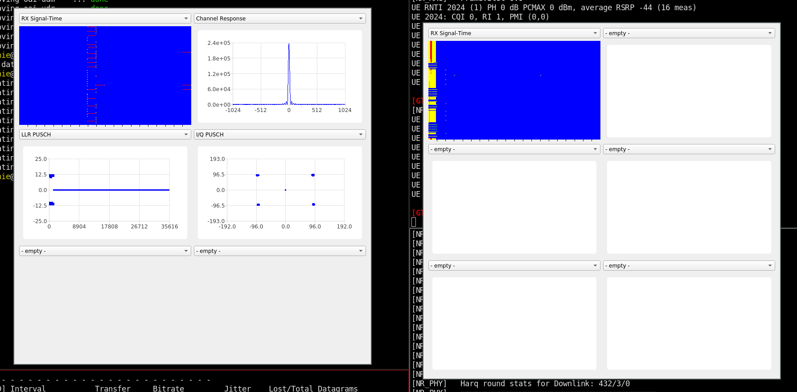
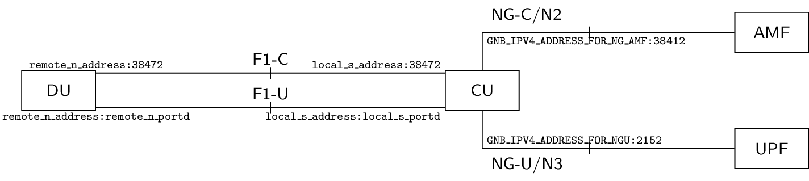
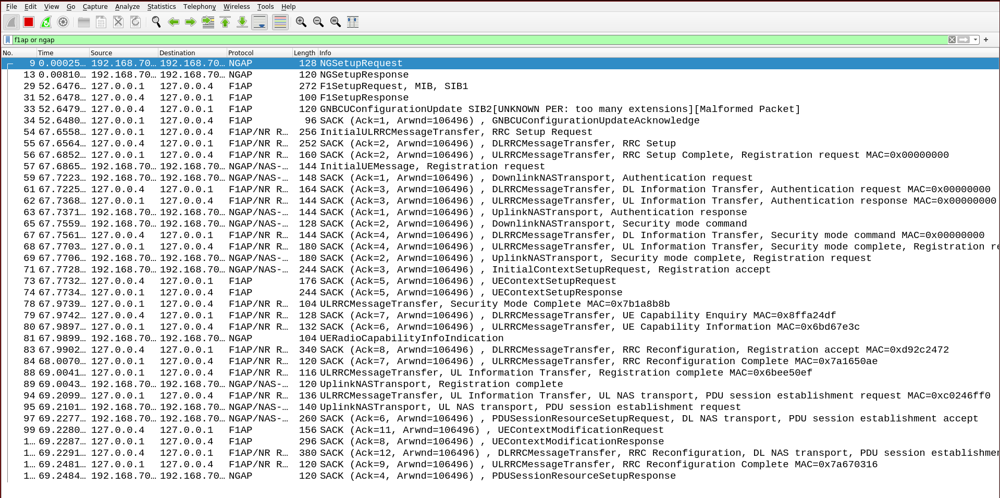
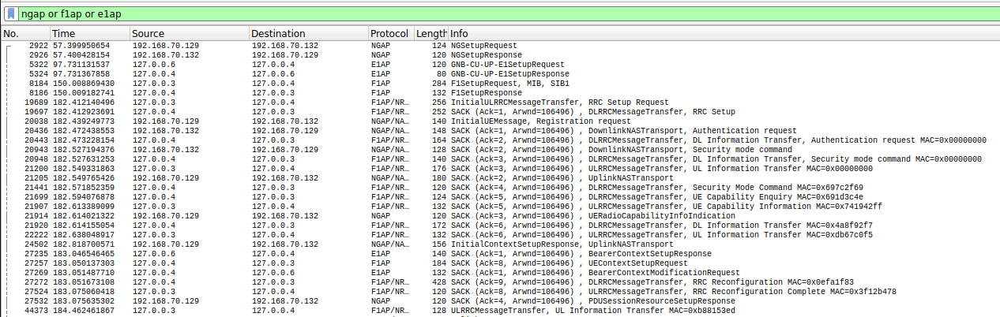

% RAN Hands-On
% Robert Schmidt, Jaroslava Fiedlerova
% July 04, 2024

<table style="border-collapse: collapse; border: none;">
  <tr style="border-collapse: collapse; border: none;">
    <td style="border-collapse: collapse; border: none;">
      <a href="http://www.openairinterface.org/">
         
         </img>
      </a>
    </td>
    <td style="border-collapse: collapse; border: none; vertical-align: center;">
      <b><font size = "5">OpenAirInterface 5G Core Network Summer Workshop 2023</font></b>
    </td>
  </tr>
</table>

**What do we cover in the RAN Hands-On?**

The aim of this tutorial is to:

1. Understand the code repository organization
2. Set-up of end-to-end 5G/NR SA setup with RFsimulator from source
4. Use of the scope(s) + basic channel modelling
5. Connect multiple UEs
6. Build docker containers of the RAN
7. Start with the DU-CU/F1 split
8. Start with the DU-CU/F1+E1 split

Note: this file can be converted to a presentation using

```
pandoc -t slidy --template ran.slidy -s README.md -o README.html
```

---

**Hardware Requirements**

1. A laptop or remote server with minimum 8vCPU and 16GB of RAM and 16GB of storage.  To avoid any problems, we expressly recommend the use of a physical machine, i.e., NO virtual machine.
2. Make sure your laptop/remote server cpu supports `avx2`. You can check via `lscpu | grep avx2`
3. Operating System: Ubuntu 22.04.04. Other operating systems might work (e.g., RHEL, Fedora); others (Arch, ...) are not tested and have no support in `build_oai`
4. Note: macOS and new M1/M2 laptops as well as the Windows Subsystem for Linux are not tested and most likely won't work

**Software Prerequisites**

none: we will install all the necessary software

**Reading time**: ~30mins

**Tutorial replication time**: ~90mins

---


**TABLE OF CONTENTS**

[[_TOC_]]


# Preparation for RAN training session

- We will have a general overview of the RAN repository
- Please don't hesitate to ask questions!

---

## Before: Installation of dependencies and compilation

Install the RAN dependencies and compile it, as this takes some time.

```
cd
git clone https://gitlab.eurecom.fr/oai/openairinterface5g.git
cd openairinterface5g/cmake_targets
git checkout 2024.w26                        # tested tag
./build_oai --ninja -I                       # install dependencies
./build_oai --ninja --gNB --nrUE -w SIMU -c  # compile gNB and nrUE
```

Note: for USRP support, you have to give the switch `-w USRP`

---

## The RAN repository

- `https://gitlab.eurecom.fr/oai/openairinterface5g`
- Work happens in the `develop` branch
- Usually one integration branch per week, tagged in the format `YYYY-wWW`, e.g., `2024.w26`
- `master` for a known stable version - release v2.0.1
- latest release: `v2.1.0` (February 2024), check [Release Notes](https://gitlab.eurecom.fr/oai/openairinterface5g/-/blob/develop/CHANGELOG.md)

---

## How to contribute

- Anyone can contribute! You are here to contribute!
- You have to sign a [Contributor License Agreement](https://openairinterface.org/legal/oai-license-model/)
- Contributions go through
  - Peer review on Gitlab
  - Continuous Integration Build and Testing
- Useful information on how to contribute to OAI --> [Contributing policies](https://gitlab.eurecom.fr/oai/openairinterface5g/-/blob/develop/doc/code-style-contrib.md)

---

## Repository structure

- `openair1`: Layer 1 (3GPP LTE Rel-10/12 PHY, NR Rel-15+ PHY)
- `openair2`: Layer 2 (3GPP LTE Rel-10 MAC/RLC/PDCP/RRC/X2AP, NR Rel-15+ MAC/RLC/PDCP/SDAP/RRC/X2AP/F1AP/E1AP), E2AP!
- `openair3`: Layer 3 (3GPP LTE Rel-10 S1AP/GTP)
- `charts`/`docker`/`openshift`: for building images
- `ci-scripts`: everything related to continuous integration/testing, configuration files
- `cmake_targets`: everything related to compilation, build artifacts in `ran_build/build`
- `common`: common code, generic libraries (Tpool, logging, configuration modules, \dots)
- `doc`: some documentation
- `executables`: LTE and NR executables
- `nfapi`: (n)FAPI split
- `radio`: radios and SDRs
- `targets`: configuration files (`PROJECTS`)

- Deep dive:
  - Where is NR PDSCH modulation? Called in `nr_generate_pdsch()`
  - Where is the NR PDSCH/DLSCH scheduler? See `gNB_dlsch_ulsch_scheduler()`
  - Where is the NR RRC Reconfiguration message sent? See `rrc_gNB_generate_dedicatedRRCReconfiguration()`
  - Where is the PDSCH simulation? See `dlschsim.c`
  - Where is the E2 agent? -> next training

# Hands-On

- Setup of a working system using simulated SDR
- Basic understanding, so we can go through E2 agent later

## About the RFsimulator

- Why don't we use real radio?
- The RFsimulator *simulates* a radio device -- it is a virtual SDR device
- Easier to set up, yet interchangeable with any other radio
- Large number of participants, no interference
- Allows the use of channel models

---

## How to build

- Use of the `build_oai` script
  - Is a wrapper for `cmake`
  - Some useful options: `-h`, `--eNB`, `--gNB`, `--UE`, `--nrUE`, `-c`, `--ninja`, `--sanitize-address`, `-g`, `-w`, `-P`/`--physical_simulators`, ...
- By default, build artifacts are in `cmake_targets/ran_build/build` (`ran_build/` configurable, see `-d` switch)
- To rebuild more quickly, issue
  ```
  ninja nr-softmodem nr-uesoftmodem dfts ldpc params_libconfig coding rfsimulator
  ```
- Also interesting: `lte-softmodem`, `lte-uesoftmodem`

---

## Basic end-to-end setup

### Startup

Start the core network:
```
cd ~/oai-workshops/cn/
docker compose -f docker-compose.yml up -d
watch -n 1 docker compose -f docker-compose.yml ps -a
```

Once all containers are healthy, run Wireshark and capture NGAP traffic (set display filter to "ngap").

```
wireshark -i any -k
```

Then, start the gNB:

```
cd ~/openairinterface5g/cmake_targets/ran_build/build
sudo -E ./nr-softmodem --rfsim --sa -O ~/oai-workshops/ran/conf/gnb.sa.band78.106prb.rfsim.conf
```

Check that you see the NGAP Setup Request and Response messages in Wireshark.

---

Run the nrUE from a second terminal:

```
cd ~/openairinterface5g/cmake_targets/ran_build/build
sudo -E ./nr-uesoftmodem -r 106 --numerology 1 --band 78 -C 3619200000 --rfsim --sa -O ~/oai-workshops/ran/conf/ue.conf
```

Verify that it is connected: you should see the following output at gNB:

```
[NR_RRC]   UE 1: Receive RRC Reconfiguration Complete message (xid 3)
[NR_RRC]   msg index 0, pdu_sessions index 0, status 2, xid 3): nb_of_pdusessions 1,  pdusession_id 10, teid: 2466254620
 [NR_RRC]   NGAP_PDUSESSION_SETUP_RESP: sending the message
```

and nrUE:

```
[NAS]   [UE 0] Received NAS_CONN_ESTABLI_CNF: errCode 1, length 99
[LIBCONFIG] nas.noS1: 3/3 parameters successfully set, (3 to default value)
[OIP]   Interface oaitun_ue1 successfully configured, ip address 10.0.0.2, mask 255.255.255.0 broadcast address 10.0.0.255
```

Correspondingly, an interface should have been brought up:
```
113: oaitun_ue1: <POINTOPOINT,MULTICAST,NOARP,UP,LOWER_UP> mtu 1500 qdisc fq_codel state UNKNOWN group default qlen 500
    link/none
    inet 10.0.0.2/24 brd 10.0.0.255 scope global oaitun_ue1
       valid_lft forever preferred_lft forever
    inet6 fe80::b732:d985:ef8b:4f9f/64 scope link stable-privacy
       valid_lft forever preferred_lft forever
```

Some other things to check:
- You see the RA procedure of the UE in the gNB logs

---

### Inject traffic

- One terminal in the host, the other in the docker container `oai-ext-dn`
```
docker exec -it oai-ext-dn bash
```

- Check the UE's IP address: interface `oaitun_ue1` using `ip address`
- Ping:
```
ping -I oaitun_ue1 192.168.70.135 # from host, "UL", to oai-ext-dn
ping <UE IP address>              # from container, "DL"
```
- Iperf3 testing:
- on `oai-ext-dn` container run iperf3 server:
```
iperf3 -s
```
- on host run iperf3 client, bind UE IP address:
```
iperf3 -B <UE IP ADDRESS> -c 192.168.70.135 -u -b 50M -R # DL
iperf3 -B <UE IP ADDRESS> -c 192.168.70.135 -u -b 20M    # UL
```

---

### A closer look at the config file

#### `gNBs` section
- `plmn_list`: list of PLMNs, with MCC, MNC, and NSSAIs; needs to match CN config
- `tracking_area_code`: Tracking Area Code; needs to match CN
- `amf_ip_address.[0].ipv4`: IP address of AMF
- `NETWORK_INTERFACES.GNB_IPV4_ADDRESS_FOR_NG_AMF` and `NETWORK_INTERFACES.GNB_IPV4_ADDRESS_FOR_NGU`: IP address on which is the gNB
- `min_rxtxtime`: minimum feedback time (e.g., PDSCH to PUCCH), is 5 for OAI UE
  and 2 for commercial UE
- `absoluteFrequencySSB` and `dl_absoluteFrequencyPointA`: frequencies for synchronization signal block and "PointA", in ARFCN; [use a calculator instead of getting mad](http://sqimway.com/nr_refA.php)
- TDD configuration is in `nrofDownlinkSlots`, `nrofUplinkSlots`,
  `nrofDownlinkSymbols` and `nrofUplinkSymbols`

#### `MACRLCs` section

- `ulsch_max_frame_inactivity`: maximum number of frames until UE is scheduled
  automatically even without requesting it. Often at `0` or `1` for lower
  latency, but this is "artificial"
- `pusch_TargetSNRx10`, `pucch_TargetSNRx10`: target SNRs multiplied by ten for
  these channels; increasing can sometimes stabilize a system
- `dl_harq_round_max`, `ul_harq_round_max`: maximum number of MAC HARQ rounds
- `dl_max_mcs`, `ul_max_mcs`: maximum MCS to be scheduled

Other parameters: see `openair2/GNB_APP/MACRLC_nr_paramdef.h`

#### `RUs` section

- `nb_tx`, `nb_rx`: number transmit/receive antennas to use
- `max_rxgain`: maximum receive gain to be used, IIRC only used for USRP
- `att_tx`, `att_rx`: attenuation for transmit/receive signals to be applied at
  gNB. In many lab scenarios, the receiver of a UE is saturated if the gNB
  sends with full power, hence you need a value greater than `0` (try, in
  order: `6`, `12`, `18`)
- `sdr_addrs`: arguments to be passed to search for SDR, e.g., IP address for
  N310

- Note: if an option is not given, a default is used (which might or might not
prevent the gNB from starting)
- You can override many options on the command line. Example: `./nr-softmodem -O gnb.conf --MACRLCs.[0].dl_max_mcs 20`

---

## Scopes

The scopes allow to see various channels.

### Xforms

- Install dependencies:
  ```
  sudo apt-get install libforms-bin libforms-dev
  ```
- Build scope:
  ```
  cd ~/openairinterface5g/cmake_targets/
  ./build_oai --build-lib nrscope --ninja
  cd ran_build/build/
  cmake -DENABLE_NRSCOPE=ON ../../../ && ninja nrscope # alternative
  ```
- Run `nr-softmodem` and `nr-uesoftmodem` with `-d` switch
- The error
  ```
  In fl_initialize() [flresource.c:995]: 5G-gNB-scope: Cant open display :0
  In fl_bgn_form() [forms.c:347]: Missing or failed call of fl_initialize()
  ```
  can be solved by granting root the right to open the X display
  ```
  xhost +si:localuser:root
  ```


---


### QtScope

- Install dependencies (note: you need Qt5, not Qt6!)
  ```
  sudo apt-get install libqt5charts5-dev
  ```
- Build scope
  ```
  cd ~/openairinterface5g/cmake_targets/
  ./build_oai --build-lib nrqtscope --ninja
  cd ran_build/build/
  cmake -DENABLE_NRQTSCOPE=ON ../../../ && ninja nrqtscope # alternative
  ```
- Run the `nr-softmodem` and `nr-uesoftmodem` with `--dqt` switch

- For more information about scopes and troubleshooting, refer to: [xForms-based Scope documentation](https://gitlab.eurecom.fr/oai/openairinterface5g/-/blob/develop/openair1/PHY/TOOLS/readme.md)



---

## Channel Models

### Enabling channels

- We will simply add Gaussian noise
- Uncomment the last line in both the gNB and UE config file:
  ```
  @include "channelmod_rfsimu.conf"
  ```
- Add the options `--rfsimulator.options chanmod --rfsimulator.modelname AWGN` to the gNB and UE command lines and start
- More info: `openair1/SIMULATION/TOOLS/DOC/channel_simulation.md`, channel models defined in `openair1/SIMULATION/TOOLS/random_channel.c`

---

### Dynamically modifying Channel Model Parameters using Telnet

- Make sure the telnet shared library is compiled:
  ```
  cd ~/openairinterface5g/cmake_targets/
  ./build_oai --build-lib telnetsrv --ninja
  cd ran_build/build/
  cmake ../../..  -DENABLE_TELNETSRV=ON && ninja telnetsrv
  ```
- Start the `nr-softmodem`/`nr-uesoftmodem` with parameter `--telnetsrv`
- Note: configure UE telnet port to be different from gNB: `--telnetsrv.listenport 9091`
- New terminal: connect to gNB/UE: `telnet 127.0.0.1 9090`
  - Use `help` to show available commands
  - Use `channelmod show current` to show current channel model configuration
  - Use `channelmod help` to show available parameters to change
  - Example: change noise using `channelmod modify 1 noise_power_dB -5`, observe in scope!
- More information: `openair1/SIMULATION/TOOLS/DOC/channel_simulation.md`

Example commands:
- gNB
```
sudo -E ./nr-softmodem --rfsim --sa -O ~/MR/oai-workshops/ran/conf/gnb.sa.band78.106prb.rfsim.conf -d --rfsimulator.serveraddr server --rfsimulator.options chanmod --rfsimulator.modelname AWGN --telnetsrv
```
- UE
```
sudo -E ./nr-uesoftmodem -r 106 --numerology 1 --band 78 -C 3619200000 --rfsim --sa --nokrnmod -O ~/MR/oai-workshops/ran/conf/ue.conf --rfsimulator.serveraddr 127.0.0.1 -d --rfsimulator.options chanmod --rfsimulator.modelname AWGN --telnetsrv --telnetsrv.listenport 9091
```
- telnet
```
telnet 127.0.0.1 9090
```
---

## Multiple UEs

- All the UEs try to open the same interface, which does not work
- Create network namespace for each UE to prevent interface name clash
- Follow instructions from [this link](https://open-cells.com/index.php/2021/02/08/rf-simulator-1-enb-2-ues-all-in-one/) or use the script [multi-ue.sh](./multi-ue.sh)
- Start first UE as
  ```
  sudo ~/oai-workshops/ran/multi-ue.sh -c1 -e
  sudo -E LD_LIBRARY_PATH=. ./nr-uesoftmodem -r 106 --numerology 1 --band 78 -C 3619200000 --rfsim --sa -O /home/richie/oai-workshops/ran/conf/ue.conf --rfsimulator.serveraddr 10.201.1.100
  ```
- Check in Wireshark/UE output that everything is ok
- Second UE *with different IMSI*
  ```
  sudo ~/oai-workshops/ran/multi-ue.sh -c2 -e
  sudo -E LD_LIBRARY_PATH=. ./nr-uesoftmodem -r 106 --numerology 1 --band 78 -C 3619200000 --rfsim --sa -O /home/richie/oai-workshops/ran/conf/ue.conf --uicc0.imsi 001010000000102 --rfsimulator.serveraddr 10.202.1.100
  ```
- Exercise: Check in Wireshark that both are set up
- Exercise: Create traffic from/to both UEs
- At the end, remove network namespaces:
  ```
  sudo ~/oai-workshops/ran/multi-ue.sh -d1 -d2
  ```

---

## How to create a docker image

- Creating a docker image is a 3-step process (due to CI specificities):
  - `ran-base` for dependencies (shared image)
  - `ran-build` for compiling all targets (shared image)
  - Per-target (eNB, gNB, nrUE, lteUE, \dots) images
- First, build the shared images:
  ```
  docker build --target ran-base --tag ran-base:latest --file docker/Dockerfile.base.ubuntu20 .
  docker build --target ran-build --tag ran-build:latest --file docker/Dockerfile.build.ubuntu20 .
  ```
- Then, build the target images, e.g., gNB and nrUE (as used in the CN session):
  ```
  docker build --target oai-gnb --tag oai-gnb:latest --file docker/Dockerfile.gNB.ubuntu20 .
  ```
- see also `docker/README.md`

---

## CU-DU F1 split

- Start Wireshark with capture filter `sctp` and dispay filter `ngap or f1ap`
- Start the gNB as follows
  ```
  sudo -E ./nr-softmodem --sa -O ~/oai-workshops/ran/conf/gnb-cu.sa.f1.conf
  sudo -E ./nr-softmodem --rfsim --sa -O ~/oai-workshops/ran/conf/gnb-du.sa.band78.106prb.rfsim.conf
  ```
- Start the UE as before
- Compare the IP addresses in the config with what you have below to understand
  the interfaces



---



---

## CU-DU F1 + E1 split

- Start Wireshark with capture filter `sctp` and dispay filter `ngap or f1ap or e1ap`
- Start the gNB as follows
```
sudo -E ./nr-softmodem --rfsim --sa -O ~/oai-workshops/ran/conf/gnb-cucp.sa.f1.rfsim.conf
sudo -E ./nr-cuup --sa -O ~/oai-workshops/ran/conf/gnb-cuup.sa.f1.rfsim.conf
sudo -E ./nr-softmodem --sa -O ~/oai-workshops/ran/conf/gnb-du.sa.band78.106prb.rfsim.conf
```
- Start the UE as before
- Compare the IP addresses in the config with what you have below to understand
  the interfaces

---


